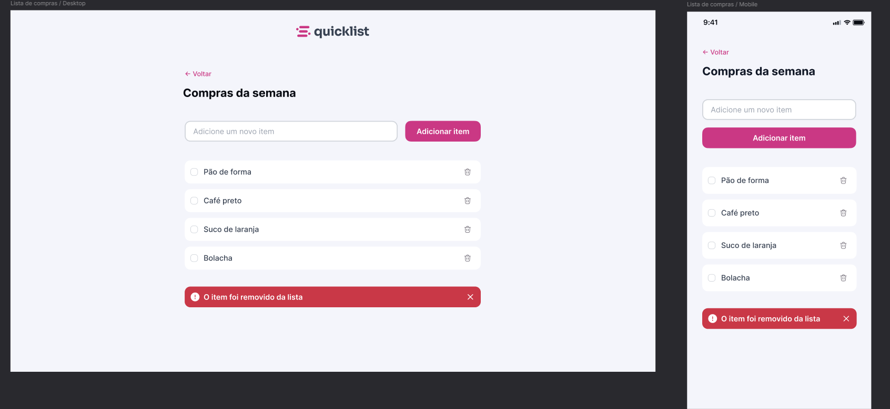

# 🛒 Lista de Compras - QuickList

Projeto de uma lista de compras interativa desenvolvido com foco em **HTML, CSS e JavaScript (Vanilla)**.

---

## 📸 Preview do Projeto



---

## 🚀 Funcionalidades

- ➕ Adicionar novos itens
- 🗑️ Remover itens da lista
- ✅ Marcar itens como concluídos
- 📱 Layout responsivo (desktop e mobile)
- 🎨 Interface baseada em design do Figma

---

## 🛠️ Tecnologias utilizadas

- HTML5
- CSS3 (Flexbox + Responsivo)
- JavaScript (Vanilla JS)

---

## 📂 Estrutura do projeto

```
## 📂 Estrutura do projeto

```
---

## 💡 Aprendizados

Durante o desenvolvimento deste projeto, foram praticados:

- Manipulação do DOM com JavaScript
- Criação dinâmica de elementos (`innerHTML`)
- Uso de Flexbox para layout
- Responsividade com Media Queries
- Customização de checkbox com CSS

---

---

## 📎 Links

- 🔗 GitHub: https://github.com/IsraellSan7os
---

## 🧑‍💻 Autor

Desenvolvido por **Israel Custódio dos Santos** 🚀
